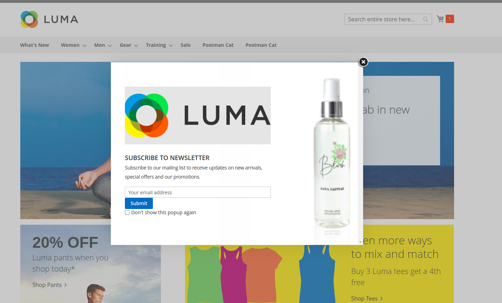
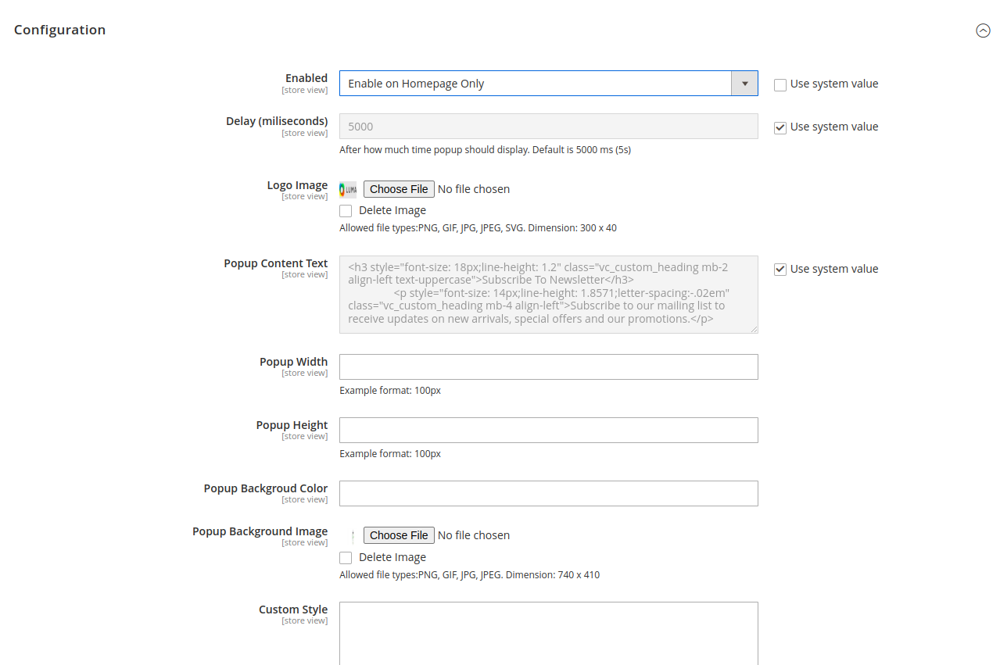

# M2Commerce Commerce: Magento 2 Newsletter Popup

## Overview
The extension allow the admin to show newsletter popup on storefront. There are alot of configuration with which admin can play.
Extension gives full control to admin to design it through configurations

## Configuration

There are several configuration options for this extension, which can be found at **STORES > Configuration > Commerce Enterprise > Newsletter Popup**.

### ScreenShots



## Installation
### Magento® Marketplace

This extension will also be available on the Magento® Marketplace when approved.

1. Go to Magento® 2 root folder
2. Require/Download this extension:

   Enter following commands to install extension.

   ```
   composer require m2commerce/newsletter-popup
   ```

   Wait while composer is updated.

   #### OR

   You can also download code from this repo under Magento® 2 following directory:

    ```
    app/code/M2Commerce/NewsletterPopup
    ```    

3. Enter following commands to enable the module:

   ```
   php bin/magento module:enable M2Commerce_NewsletterPopup
   php bin/magento setup:upgrade
   php bin/magento setup:di:compile
   php bin/magento cache:clean
   php bin/magento cache:flush
   ```

4. If Magento® is running in production mode, deploy static content:

   ```
   php bin/magento setup:static-content:deploy
   ```
